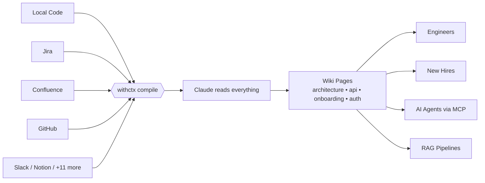

# withctx

[](https://github.com/imamchishty/withctx/actions/workflows/ci.yml)
[](https://github.com/imamchishty/withctx/actions/workflows/ci.yml)

**AI compiles your project knowledge into a living wiki that engineers and agents read before writing code.**

<p align="center">
  
</p>

<p align="center">
  
</p>

withctx connects to where your knowledge already lives — Jira, Confluence, Teams, GitHub, Slack, Notion, SharePoint, local docs — and has AI compile it into structured markdown pages. Engineers read it to onboard. Agents read it before writing code.

```
Your scattered knowledge              Compiled wiki
─────────────────────                  ─────────────
147 Jira tickets                  →    services/payments.md
23 Confluence pages               →    architecture.md
500 Teams messages                →    decisions.md
6 GitHub repos                    →    repos/api-service/overview.md
12 PDFs and Word docs             →    conventions.md
CI/CD pipeline data               →    repos/api-service/ci.md
Coverage reports                  →    repos/api-service/testing.md
Sarah's head                      →    manual/kafka-decision.md
```

## Get Started in 30 Seconds

```bash
npm install -g withctx
export ANTHROPIC_API_KEY=sk-ant-your-key-here   # get one at console.anthropic.com
cd your-project
ctx setup                                        # That's it. One command.
```

`ctx setup` detects your sources, creates the config, and compiles the wiki. (`ctx init` and `ctx go` are aliases.) Then ask it anything:

```bash
ctx query "how does auth work?"
ctx chat                              # Interactive Q&A
```

**Prerequisites:** Node.js 20+ and an API key from Anthropic, OpenAI, Google, or Ollama (local).

## Install & Update

```bash
# Install
npm install -g withctx

# Check your version
ctx --version

# Update to latest
npm update -g withctx
```

## Power Features

These are the commands that make withctx unique — no other tool has this depth of project understanding:

```bash
# Context-aware PR review — catches issues no linter can find
ctx review https://github.com/acme/api-service/pull/47

# Deep file explanation — not just what, but WHY and how it connects
ctx explain src/middleware/auth.ts

# Impact analysis — "what would break if we..."
ctx impact "migrate from MongoDB to PostgreSQL"

# Auto-generated FAQ — top 20 questions every engineer asks
ctx faq --for new-engineer

# Auto release notes from git + wiki context
ctx changelog --since v2.3.0

# Project health dashboard (free, no Claude call)
ctx metrics
```

## How It Works

Inspired by [Karpathy's LLM Wiki pattern](https://gist.github.com/karpathy/442a6bf555914893e9891c11519de94f): knowledge is compiled once into maintained wiki pages, not re-derived on every query.



```
.ctx/context/
├── index.md             # Catalog of all pages (browsable on GitHub)
├── overview.md          # Project summary
├── architecture.md      # Services, deps, infra
├── decisions.md         # ADRs, key choices
├── conventions.md       # Standards, patterns
├── faq.md               # Auto-generated FAQ
├── repos/               # Per-repo deep context
├── cross-repo/          # Dependencies, data flow, deploy order
├── services/            # Business domain context
├── people/              # Team ownership
├── onboarding/          # Auto-generated guides
└── manual/              # Manually added context
```

## MCP Integration (AI Agent Support)

Connect AI coding agents directly to your wiki using MCP (Model Context Protocol). Agents can search context, read architecture docs, and store learnings — automatically, while they work.

```bash
ctx mcp --list                        # See all 10 available tools
```

**Claude Code** — add to `.claude/settings.json`:
```json
{
  "mcpServers": {
    "withctx": {
      "command": "npx",
      "args": ["-y", "withctx", "mcp"],
      "cwd": "/path/to/your/project"
    }
  }
}
```

**Cursor** — add to `.cursor/mcp.json`:
```json
{
  "mcpServers": {
    "withctx": {
      "command": "npx",
      "args": ["-y", "withctx", "mcp"],
      "cwd": "/path/to/your/project"
    }
  }
}
```

See [MCP Integration Guide](docs/guide/19-mcp-integration.md) for full setup with all tools.

## RAG Exports

Export your wiki in formats ready for AI pipelines (LangChain, LlamaIndex, or plain JSON chunks):

```bash
ctx export --format langchain          # LangChain Document objects
ctx export --format llamaindex         # LlamaIndex Node objects
ctx export --format rag-json           # Framework-agnostic JSON chunks
ctx export --format rag-json --chunk-size 256   # Custom chunk size
```

## Vector Search

Search your wiki by meaning, not just keywords:

```bash
ctx embed                                    # Generate embeddings (one-time)
ctx search "how does authentication work"    # Semantic search
```

## All Commands

| Command | What it does | Costs? |
|---------|-------------|--------|
| `ctx setup` | One command to start — detect sources, write `ctx.yaml`, compile wiki. `ctx init` and `ctx go` are aliases. | Paid (skip with `--no-ingest`) |
| `ctx doctor` | Pre-flight diagnostics | Free |
| `ctx todos` | Scan code for TODO/FIXME markers, optionally write to the wiki | Free |
| `ctx ingest` | Full wiki compilation from all sources | Paid |
| `ctx sync` | Incremental update (changed sources only) | Paid |
| `ctx query` | Ask a question, get an answer with sources | Paid |
| `ctx chat` | Interactive Q&A session | Paid |
| `ctx add` | Add manual context (notes, decisions, corrections) | Paid |
| `ctx review` | Context-aware PR review | Paid |
| `ctx explain` | Deep file explanation with wiki context | Paid |
| `ctx impact` | Impact analysis for proposed changes | Paid |
| `ctx faq` | Auto-generate FAQ from wiki | Paid |
| `ctx changelog` | Auto release notes from git + wiki | Paid |
| `ctx lint` | Check for contradictions, stale content, broken links | Paid |
| `ctx pack` | Export wiki as CLAUDE.md / system prompt | Free |
| `ctx export` | Export wiki (markdown, JSON, LangChain, LlamaIndex, RAG) | Free |
| `ctx embed` | Generate vector embeddings for semantic search | Depends |
| `ctx search` | Semantic search across wiki | Free |
| `ctx mcp` | Start MCP server for AI agent integration | Free |
| `ctx onboard` | Generate onboarding guide | Paid |
| `ctx import` | Import existing markdown into wiki | Paid |
| `ctx status` | Show wiki health and freshness | Free |
| `ctx metrics` | Health dashboard with score 0-100 | Free |
| `ctx timeline` | Visualize project history | Free |
| `ctx diff` | Show wiki changes since last sync | Free |
| `ctx graph` | Visualize page relationships (mermaid) | Free |
| `ctx config` | View/edit ctx.yaml from CLI | Free |
| `ctx sources` | Manage source connectors | Free |
| `ctx repos` | Manage repository registrations | Free |
| `ctx costs` | Token usage and cost report | Free |
| `ctx watch` | Auto-sync on file changes | Paid |
| `ctx reset` | Wipe wiki and recompile | Free |
| `ctx serve` | Start REST API server | Free |

## 16 Source Connectors

| Source | What it ingests | Deployment modes |
|--------|----------------|-----------------|
| **Local files** | Markdown, code, text files | n/a |
| **PDF** | Text, tables, sections | n/a |
| **Word** (.docx) | Text, tables, embedded diagrams (Claude vision) | n/a |
| **PowerPoint** (.pptx) | Slides, speaker notes, embedded images | n/a |
| **Excel** (.xlsx/.csv) | Sheets, data, headers as markdown tables | n/a |
| **GitHub** | Repos, issues, PRs, code | **Cloud, GHES, GitHub Actions** |
| **Jira** | Issues, epics, comments (multiple projects, JQL, labels) | **Cloud + Server/DC (PAT)** |
| **Confluence** | Pages, spaces (multiple spaces, labels, page trees) | **Cloud + Server/DC (PAT)** |
| **Microsoft Teams** | Channels, threads, transcripts (noise filtered) | Cloud (Microsoft Graph) |
| **SharePoint** | Word, Excel, PowerPoint, PDF from one or many sites | Cloud (Microsoft Graph) |
| **CI/CD** | GitHub Actions workflow runs, build stats, failure analysis |
| **Test Coverage** | lcov, istanbul, cobertura reports with per-file breakdown |
| **Pull Requests** | Merged PRs, reviewers, files changed, activity patterns |
| **OpenAPI** | API endpoints, schemas, auth requirements |
| **Notion** | Database entries, pages, content blocks |
| **Slack** | Channel messages, threads (noise filtered) |

## Running on a Corporate / On-Prem Network

withctx is built to run inside a corporate network with self-hosted Jira,
Confluence, and GitHub Enterprise Server behind a TLS-intercepting proxy.
Every network-bound connector goes through the same fetch stack, so two
environment variables configure the whole tool:

```bash
# Trust the corporate CA bundle so Jira/Confluence/GitHub TLS
# handshakes don't fail with "self-signed certificate in chain".
export NODE_EXTRA_CA_CERTS=/etc/ssl/certs/corp-ca.pem

# Route all outbound requests through the corporate proxy. Node's
# global fetch doesn't honour this by default — withctx installs an
# undici EnvHttpProxyAgent at startup so it just works.
export HTTPS_PROXY=http://proxy.corp.example.com:8080
export NO_PROXY=.corp.example.com,localhost
```

Confirm everything resolves correctly before compiling a wiki:

```bash
ctx doctor                 # prints a Network section with ✓ / ✗ per setting
npm run smoke:onprem jira  # real-call smoke test, one connector at a time
```

`ctx.yaml` for an on-prem stack — no Cloud flags needed:

```yaml
project: acme-platform
sources:
  jira:
    - name: corp-jira
      base_url: https://jira.corp.example.com   # Server/DC, no email → PAT auth
      token: ${JIRA_TOKEN}
      project: ENG

  confluence:
    - name: corp-wiki
      base_url: https://confluence.corp.example.com
      token: ${CONFLUENCE_TOKEN}
      space: ENG

  github:
    - name: corp-github
      base_url: https://github.corp.example.com  # GHES — /api/v3 auto-appended
      owner: platform
      token: ${GH_PAT}

  sharepoint:
    - name: engineering-drive
      site: acme.sharepoint.com/sites/engineering
      paths: [/Shared Documents/Handbook, /Shared Documents/ADRs]
      filetypes: [.docx, .pdf, .xlsx]
    - name: finance-drive                         # multiple sites in one run
      site: acme.sharepoint.com/sites/finance
      files: [/Shared Documents/FY24/budget.xlsx]
```

For Cloud you add `email:` to the Jira/Confluence entries, or drop
`base_url` from the GitHub entry. Everything else stays the same.

## Running in GitHub Actions

Inside a workflow, the GitHub connector picks up `GITHUB_TOKEN` and
`GITHUB_API_URL` from the runner — so the exact same `ctx.yaml` that
works on a laptop also works in CI, on github.com and GitHub
Enterprise Server alike, with no environment-specific edits.

```yaml
# .github/workflows/sync-context.yml
name: Sync Context
on:
  schedule:
    - cron: "*/30 * * * *"
  workflow_dispatch:

jobs:
  sync:
    runs-on: self-hosted   # use your GHES runner pool
    steps:
      - uses: actions/checkout@v4
      - run: npm install -g withctx
      - run: ctx sync
        env:
          ANTHROPIC_API_KEY:  ${{ secrets.ANTHROPIC_API_KEY }}
          JIRA_TOKEN:         ${{ secrets.JIRA_TOKEN }}
          CONFLUENCE_TOKEN:   ${{ secrets.CONFLUENCE_TOKEN }}
          # GITHUB_TOKEN + GITHUB_API_URL are injected automatically
      - run: |
          git add .ctx/
          git diff --staged --quiet || \
            git commit -m "ctx: sync $(date -u +%Y-%m-%dT%H:%M:%SZ)"
          git push
```

## Single Repo vs Multi-Repo

**Single repo** — wiki lives in the repo:
```
my-project/
├── src/
├── .ctx/context/     # wiki here — committed to git
└── ctx.yaml
```

**Multi-repo** — dedicated context repo:
```
acme/context/         # separate repo for the wiki
├── .ctx/context/     # wiki spanning all repos
├── ctx.yaml          # references all repos + external sources
└── .github/workflows/sync.yml  # auto-sync every 30 min
```

## For AI Agents

Agents read the compiled wiki before writing code. Three ways to connect:

```bash
# 1. MCP — agents connect directly (recommended)
ctx mcp                               # Start MCP server for Claude Code, Cursor, Windsurf

# 2. Generate CLAUDE.md as a static file
ctx pack --format claude-md --output CLAUDE.md

# 3. REST API for custom integrations
ctx serve                             # REST API on :4400
```

## Cost

Typical monthly costs:

| Team Size | Monthly Cost |
|-----------|-------------|
| Small (1 repo, 5 engineers) | ~$3-13 |
| Medium (5 repos, Jira + Confluence) | ~$10-40 |
| Large (15+ repos, full integration) | ~$20-120 |

Uses prompt caching for ~90% cost reduction on repeated context. Budget enforcement built in.

## Documentation

- [Quick Start](docs/guide/02-quickstart.md) — zero to working wiki in 30 seconds
- [All Commands](docs/guide/07-commands.md) — full CLI reference (34 commands)
- [Source Setup](docs/guide/05-sources.md) — configure all 16 connectors
- [Power Features](docs/guide/17-new-features.md) — review, explain, impact, vector search, and more
- [Microservices Guide](docs/guide/18-microservices.md) — multi-repo teams
- [MCP Integration](docs/guide/19-mcp-integration.md) — AI agent setup for Claude Code, Cursor, Windsurf
- [For Agents](docs/guide/15-for-agents.md) — agent integration guide
- [Full Guide](docs/guide/) — all 19 pages

## Contributing

See [CONTRIBUTING.md](CONTRIBUTING.md). Easiest ways to contribute:
- Add a new connector (Google Drive, Linear, Asana, Trello)
- Add an export format (Cursor rules, Windsurf, Copilot)
- Add a lint rule
- Improve documentation

## License

MIT
