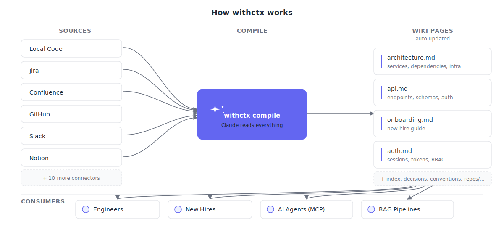

# withctx

[](https://github.com/imamchishty/withctx/actions/workflows/ci.yml)
[](https://github.com/imamchishty/withctx/actions/workflows/ci.yml)

**AI compiles your project knowledge into a living wiki that engineers and agents read before writing code.**

<p align="center">
  
</p>

withctx connects to where your knowledge already lives — Jira, Confluence, Teams, GitHub, Slack, Notion, SharePoint, local docs — and has AI compile it into structured markdown pages. Engineers read it to onboard. Agents read it before writing code.

```
Your scattered knowledge              Compiled wiki
─────────────────────                  ─────────────
147 Jira tickets                  →    services/payments.md
23 Confluence pages               →    architecture.md
500 Teams messages                →    decisions.md
6 GitHub repos                    →    repos/api-service/overview.md
12 PDFs and Word docs             →    conventions.md
CI/CD pipeline data               →    repos/api-service/ci.md
Coverage reports                  →    repos/api-service/testing.md
Sarah's head                      →    manual/kafka-decision.md
```

## Get Started in 30 Seconds

```bash
npm install -g withctx
export ANTHROPIC_API_KEY=sk-ant-your-key-here   # or set ai.api_key in ctx.yaml
cd your-project
ctx setup                                        # That's it. One command.
```

`ctx setup` detects your sources, creates the config, and compiles the wiki. (`ctx init` and `ctx go` are aliases.) Then ask it anything:

```bash
ctx ask "how does auth work?"
ctx ask --chat                        # Interactive Q&A session
```

**Prerequisites:** Node.js 20+ and an API key from Anthropic, OpenAI, Google, or Ollama (local).

## Install & Update

```bash
# Install
npm install -g withctx

# Check your version
ctx --version

# Update to latest
npm update -g withctx
```

## How It Works

Inspired by [Karpathy's LLM Wiki pattern](https://gist.github.com/karpathy/442a6bf555914893e9891c11519de94f): knowledge is compiled once into maintained wiki pages, not re-derived on every query.

```
.ctx/context/
├── index.md             # Catalog of all pages (browsable on GitHub)
├── overview.md          # Project summary
├── architecture.md      # Services, deps, infra
├── decisions.md         # ADRs, key choices
├── conventions.md       # Standards, patterns
├── repos/               # Per-repo deep context
├── cross-repo/          # Dependencies, data flow, deploy order
├── services/            # Business domain context
├── onboarding/          # Auto-generated guides
└── manual/              # Manually added context
```

## The 12 Commands

withctx has 12 core verbs. Learn five — `ask`, `sync`, `status`, `approve`, `lint` — and you have 80% of the value.

| Verb | What it does | Cost |
|------|-------------|------|
| **`ctx setup`** | Detect sources, write `ctx.yaml`, compile the wiki | Paid |
| **`ctx doctor`** | Diagnose setup, credentials, network, dependencies | Free |
| **`ctx llm`** | Check LLM connectivity — one ping, clear yes/no | Free |
| **`ctx config`** | View or edit configuration (sources, repos, keys) | Free |
| **`ctx sync`** | Refresh the wiki from sources (incremental) | Paid |
| **`ctx ask "..."`** | Ask the wiki anything (`--chat`, `--search`, `--who`) | Paid |
| **`ctx status`** | Wiki health dashboard (`--metrics`, `--costs`, `--todos`) | Free |
| **`ctx lint`** | Check for contradictions, drift, secrets | Paid |
| **`ctx approve`** | Sign off on a page (human review stamp) | Free |
| **`ctx verify`** | Check the page's claims against the live code tree | Free |
| **`ctx review`** | Drift check a PR against approved pages | Free/Paid |
| **`ctx teach`** | Drill yourself on what the wiki says | Free |
| **`ctx pack`** | Pack the wiki for agents (`--mcp`, `--serve`, `--export`) | Free |

> **Old commands still work.** `ctx query`, `ctx chat`, `ctx ingest`, `ctx search`, `ctx costs`, `ctx sources`, `ctx serve`, `ctx mcp`, etc. are all hidden aliases that still run — they just don't clutter `ctx help` anymore. See [`docs/guide/03-commands.md`](docs/guide/03-commands.md) for the full absorption map.

## The Trust Pipeline

Four verbs take a page from "Claude wrote it" to "the team stands behind it, and CI protects it":

```
ctx sync  →  ctx approve  →  ctx verify  →  ctx review
 (draft)      (human read)    (assertions)   (PR guard)
```

`approve`, `verify`, and `review --drift` are deterministic and LLM-free — safe to run in CI and pre-commit hooks without spending a cent.

## Source Connectors

| Source | What it ingests | Deployment |
|--------|----------------|-----------|
| **Local files** | Markdown, code, config, text | n/a |
| **PDF** | Text, tables, sections via `pdf-parse` | n/a |
| **Word** (.docx) | Text, tables via `mammoth` | n/a |
| **PowerPoint** (.pptx) | Slides, speaker notes via `jszip` | n/a |
| **Excel** (.xlsx/.csv) | Sheets as markdown tables via `xlsx` | n/a |
| **GitHub** | Repos, issues, PRs, code | Cloud, GHES, Actions |
| **Jira** | Issues, epics, comments, JQL filters | Cloud + Server/DC (PAT) |
| **Confluence** | Pages, spaces, labels, page trees | Cloud + Server/DC (PAT) |
| **Teams** | Channels, threads, transcripts (noise filtered) | Cloud (Graph API) |
| **SharePoint** | Word, Excel, PDF from one or many sites | Cloud (Graph API) |
| **CI/CD** | GitHub Actions workflow runs, build stats | Cloud, GHES, Actions |
| **Pull Requests** | Merged PRs, reviewers, activity patterns | Cloud, GHES |
| **Test Coverage** | lcov, istanbul, cobertura reports | n/a |
| **OpenAPI** | API endpoints, schemas, auth requirements | n/a |
| **Notion** | Database entries, pages, content blocks | Cloud |
| **Slack** | Channel messages, threads (noise filtered) | Cloud |

Binary documents (PDF, Word, Excel, PowerPoint) work through both the **local** connector (just drop files into a `path:` folder) and through **SharePoint**. Parsers load via dynamic import — projects without binary docs don't pay the startup cost.

## LLM Configuration

Two ways to configure your LLM — env vars or `ctx.yaml`. Both are equal; env var wins if both are set.

**Environment variable (recommended for CI / shared repos):**
```bash
export ANTHROPIC_API_KEY=sk-ant-...
```

**ctx.yaml (recommended for solo / local use):**
```yaml
ai:
  provider: anthropic              # anthropic | openai | google | ollama
  model: claude-sonnet-4-20250514  # optional — uses provider default
  api_key: sk-ant-...              # or ${ANTHROPIC_API_KEY} for interpolation
```

Verify connectivity:
```bash
ctx llm       # one ping — shows provider, model, endpoint, latency, key source
ctx doctor    # full diagnostic
```

See [`docs/guide/07-config-reference.md`](docs/guide/07-config-reference.md) for every `ctx.yaml` field.

## Running on a Corporate / On-Prem Network

withctx runs unmodified inside a corporate network with self-hosted Jira, Confluence, and GitHub Enterprise Server behind a TLS-intercepting proxy. Two environment variables configure the whole tool:

```bash
export NODE_EXTRA_CA_CERTS=/etc/ssl/certs/corp-ca.pem
export HTTPS_PROXY=http://proxy.corp.example.com:8080
export NO_PROXY=.corp.example.com,localhost
```

On-prem Jira/Confluence — drop `email:` and it switches from Cloud Basic auth to Server/DC Bearer PAT auth automatically. GHES — set `base_url:` and it auto-appends `/api/v3`.

```bash
ctx doctor    # Network section shows ✓/✗ per setting
```

## Running in GitHub Actions

Inside a workflow, the GitHub connector picks up `GITHUB_TOKEN` and `GITHUB_API_URL` from the runner — the same `ctx.yaml` works on a laptop, in CI, and on GHES with no edits.

```yaml
# .github/workflows/sync-context.yml
name: Sync Context
on:
  schedule:
    - cron: "*/30 * * * *"
  workflow_dispatch:

jobs:
  sync:
    runs-on: self-hosted
    steps:
      - uses: actions/checkout@v4
      - run: npm install -g withctx
      - run: ctx sync
        env:
          ANTHROPIC_API_KEY:  ${{ secrets.ANTHROPIC_API_KEY }}
          JIRA_TOKEN:         ${{ secrets.JIRA_TOKEN }}
          CONFLUENCE_TOKEN:   ${{ secrets.CONFLUENCE_TOKEN }}
      - run: |
          git add .ctx/
          git diff --staged --quiet || \
            git commit -m "ctx: sync $(date -u +%Y-%m-%dT%H:%M:%SZ)"
          git push
```

## Single Repo vs Multi-Repo

**Single repo** — wiki lives in the repo:
```
my-project/
├── src/
├── .ctx/context/     # wiki here — committed to git
└── ctx.yaml
```

**Multi-repo** — dedicated context repo:
```
acme/context/         # separate repo for the wiki
├── .ctx/context/     # wiki spanning all repos
├── ctx.yaml          # references all repos + external sources
└── .github/workflows/sync.yml  # auto-sync every 30 min
```

## For AI Agents

Agents read the compiled wiki before writing code:

```bash
ctx pack                              # Emit CLAUDE.md / system prompt
ctx pack --mcp                        # Start MCP server for Claude Code / Cursor
ctx pack --serve                      # REST API on :4400
```

**Claude Code** — add to `.claude/settings.json`:
```json
{
  "mcpServers": {
    "withctx": {
      "command": "npx",
      "args": ["-y", "withctx", "mcp"],
      "cwd": "/path/to/your/project"
    }
  }
}
```

## Cost

Typical monthly costs:

| Team Size | Monthly Cost |
|-----------|-------------|
| Small (1 repo, 5 engineers) | ~$3-13 |
| Medium (5 repos, Jira + Confluence) | ~$10-40 |
| Large (15+ repos, full integration) | ~$20-120 |

Uses prompt caching for ~90% cost reduction on repeated context. Budget enforcement built in (`ctx status --costs`).

## Documentation

- [Quick Start](docs/guide/01-quickstart.md) — zero to working wiki in 30 seconds
- [Sources](docs/guide/02-sources.md) — configure all 16 connectors
- [Commands](docs/guide/03-commands.md) — full reference for the 12 verbs
- [Recipes](docs/guide/04-recipes.md) — multi-repo, CI sync, monorepo patterns
- [For Agents](docs/guide/05-for-agents.md) — agent integration guide
- [Troubleshooting](docs/guide/06-troubleshooting.md) — common issues and fixes
- [Config Reference](docs/guide/07-config-reference.md) — every `ctx.yaml` field

## License

MIT
